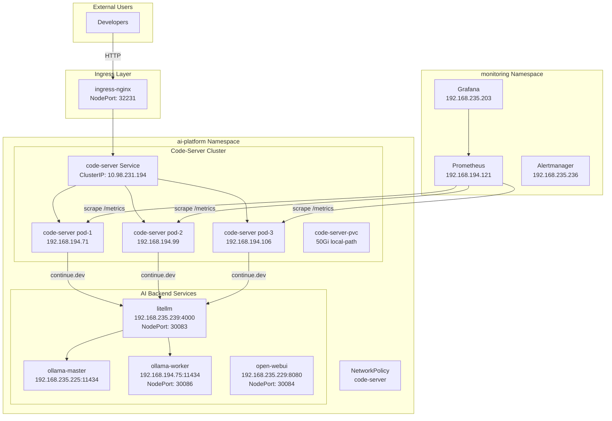
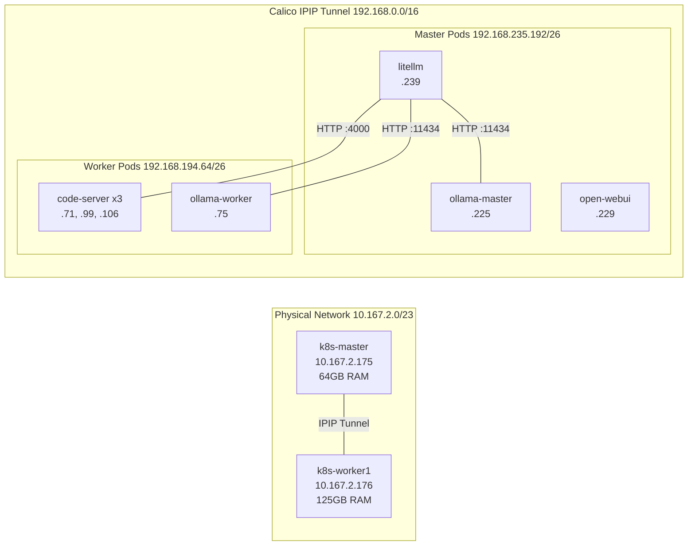
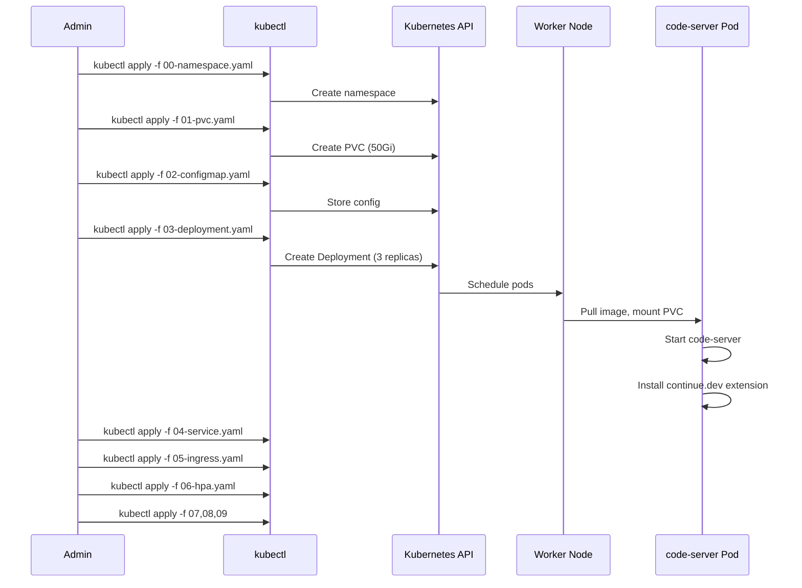
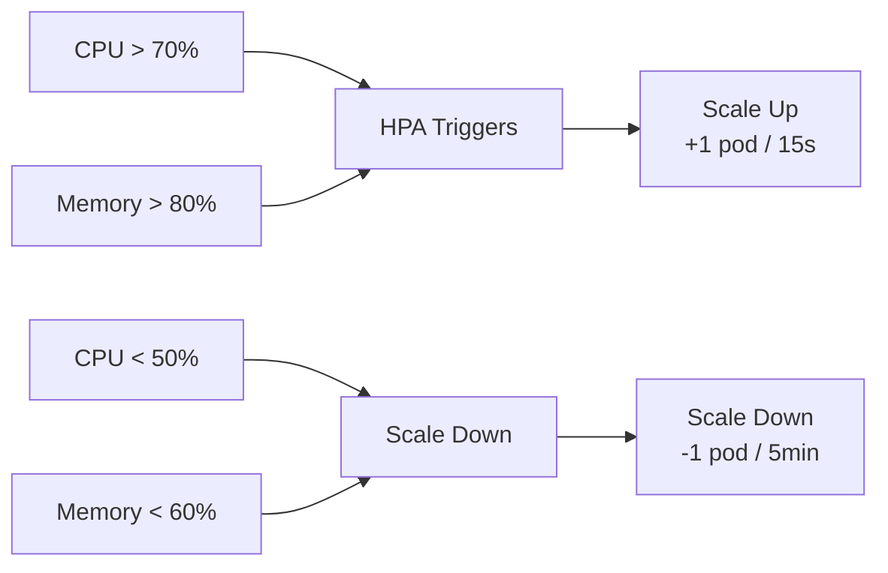
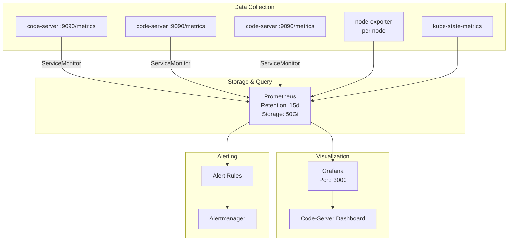
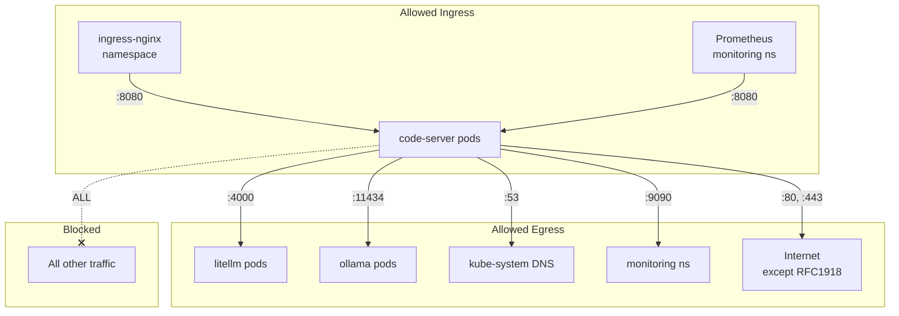

# Code-Server Enterprise Operation Guide

> **Cluster**: ai-platform | **Version**: 1.0 | **Last Updated**: 2026-06-12

---

## Table of Contents

1. [Architecture Overview](#1-architecture-overview)
2. [Prerequisites](#2-prerequisites)
3. [Deployment Guide](#3-deployment-guide)
4. [Configuration](#4-configuration)
5. [Scaling & HPA](#5-scaling--hpa)
6. [Monitoring & Observability](#6-monitoring--observability)
7. [Security](#7-security)
8. [Troubleshooting](#8-troubleshooting)
9. [Maintenance](#9-maintenance)

---

## 1. Architecture Overview

### 1.1 System Architecture



### 1.2 Network Topology



### 1.3 Service Mesh

| Service | Type | ClusterIP | Port | NodePort | Pods |
|---------|------|-----------|------|----------|------|
| code-server | ClusterIP | 10.98.231.194 | 8080, 9090 | - | 3 |
| litellm | NodePort | 10.108.11.54 | 4000 | 30083 | 1 |
| ollama-master | Headless | None | 11434 | - | 1 |
| ollama-worker | Headless + NodePort | 10.110.110.71 | 11434 | 30086 | 1 |
| open-webui | NodePort | 10.100.77.89 | 8080 | 30084 | 1 |

---

## 2. Prerequisites

### 2.1 Cluster Requirements

- Kubernetes 1.28+
- Calico CNI with IPIP tunneling enabled
- ingress-nginx controller
- kube-prometheus-stack (for monitoring)
- StorageClass: `local-path` (default) or NFS CSI

### 2.2 Node Resources

| Node | CPU | RAM | Role |
|------|-----|-----|------|
| k8s-master | 16 cores | 64GB | Control plane + AI services |
| k8s-worker1 | 32 cores | 125GB | Code-server + worker AI |

### 2.3 Required Tools

- `kubectl` configured for the cluster
- `helm` (for monitoring stack)
- Access to Docker registry for custom images

---

## 3. Deployment Guide

### 3.1 Manifest Overview

All manifests are in `code-server-enterprise/`:

| # | File | Purpose |
|---|------|---------|
| 00 | `00-namespace.yaml` | Creates `ai-platform` namespace |
| 01 | `01-pvc.yaml` | 50Gi persistent storage for workspaces |
| 02 | `02-configmap.yaml` | Code-server + continue.dev configuration |
| 03 | `03-deployment.yaml` | 3-replica deployment with health probes |
| 04 | `04-service.yaml` | ClusterIP service (8080 app, 9090 metrics) |
| 05 | `05-ingress.yaml` | HTTP ingress via ingress-nginx |
| 06 | `06-hpa.yaml` | Horizontal Pod Autoscaler (3-20 replicas) |
| 07 | `07-servicemonitor.yaml` | Prometheus ServiceMonitor for metrics |
| 08 | `08-grafana-dashboard.yaml` | Pre-configured Grafana dashboard |
| 09 | `09-networkpolicy.yaml` | Zero-trust network security policy |

### 3.2 Deployment Flow



### 3.3 Quick Deploy

```bash
# Deploy all manifests
kubectl apply -f code-server-enterprise/

# Verify deployment
kubectl get all -n ai-platform
kubectl get pods -n ai-platform -l app.kubernetes.io/name=code-server

# Check logs
kubectl logs -n ai-platform -l app.kubernetes.io/name=code-server --tail=50
```

### 3.4 Access

```
# Via ingress (HTTP)
http://code-server.ai-platform.local:32231/

# Via port-forward (for debugging)
kubectl port-forward -n ai-platform svc/code-server 8080:8080
```

---

## 4. Configuration

### 4.1 Code-Server ConfigMap

Key settings in `02-configmap.yaml`:

```yaml
data:
  config.yaml: |
    bind-addr: 0.0.0.0:8080
    auth: password
    password: "admin123"  # CHANGE IN PRODUCTION
    cert: false
```

### 4.2 Continue.dev Configuration

The continue.dev extension is auto-installed via init container. Configuration is stored in the ConfigMap and mounted at `/home/coder/.continue/config.json`.

**Configured Models (via litellm proxy)**:

| Model | Provider | RPM | TPM |
|-------|----------|-----|-----|
| qwen2.5:72b | ollama/qwen2.5:72b | 3 | 15000 |
| qwen2.5:32b | ollama/qwen2.5:32b | 10 | 50000 |
| deepseek-r1:32b | ollama/deepseek-r1:32b | 5 | 20000 |
| qwen2.5:14b | ollama/qwen2.5:14b-instruct-q5_K_M | 20 | 80000 |
| deepseek-r1:14b | ollama/deepseek-r1:14b | 10 | 40000 |
| qwen2.5:7b | ollama/qwen2.5:7b-instruct-q4_K_M | 40 | 150000 |
| bge-m3 | ollama/bge-m3 (embedding) | 120 | - |
| qwen2.5-coder:14b | ollama/qwen2.5-coder:14b-instruct-q4_K_M | 30 | 100000 |

### 4.3 Litellm Configuration

```yaml
# Key settings
general_settings:
  otel: false
  proxy_batch_responses: true

router_settings:
  routing_strategy: "latency-based-routing"
  allowed_fails: 3
  num_retries: 2
  cooldown: 60

# Fallback chain
fallbacks:
  - qwen2.5:14b: [qwen2.5:14b-fallback]
  - deepseek-r1:14b: [qwen2.5:14b]
```

### 4.4 Environment Variables

| Variable | Value | Purpose |
|----------|-------|---------|
| `LITELLM_MASTER_KEY` | `sk-ai-platform-master` | API authentication |
| `LITELLM_ALLOW_REQUESTS_WITHOUT_API_KEY` | `true` | Allow unauthenticated health checks |
| `LITELLM_EXPERIMENTAL_DISABLE_ANTHROPIC_PASS_THROUGH` | `true` | Disable Anthropic pass-through |

---

## 5. Scaling & HPA

### 5.1 HPA Configuration

```yaml
spec:
  scaleTargetRef:
    name: code-server
  minReplicas: 3
  maxReplicas: 20
  metrics:
    - type: Resource
      resource:
        name: cpu
        target:
          type: Utilization
          averageUtilization: 70
    - type: Resource
      resource:
        name: memory
        target:
          type: Utilization
          averageUtilization: 80
```

### 5.2 Scaling Behavior



### 5.3 Check HPA Status

```bash
kubectl get hpa -n ai-platform
kubectl describe hpa -n ai-platform code-server
```

---

## 6. Monitoring & Observability

### 6.1 Monitoring Architecture



### 6.2 ServiceMonitor

The ServiceMonitor (`07-servicemonitor.yaml`) configures Prometheus to scrape code-server metrics:

```yaml
spec:
  endpoints:
    - port: metrics
      interval: 30s
      path: /metrics
  selector:
    matchLabels:
      app.kubernetes.io/name: code-server
```

### 6.3 Grafana Dashboard

Pre-configured dashboard (`08-grafana-dashboard.yaml`) includes:

- **Pod Health**: Running/Ready status, restart count
- **Resource Usage**: CPU, Memory, Network per pod
- **HPA Status**: Current vs desired replicas, CPU/Memory utilization
- **Request Metrics**: HTTP request rate, latency, error rate
- **Session Metrics**: Active sessions, session duration

### 6.4 Key Metrics

| Metric | Description | Alert Threshold |
|--------|-------------|-----------------|
| `code_server_active_sessions` | Active user sessions | > 15 (scale warning) |
| `container_cpu_usage_seconds_total` | CPU usage per container | > 80% |
| `container_memory_working_set_bytes` | Memory usage | > 80% |
| `kube_pod_status_ready` | Pod readiness | < 3 (critical) |
| `http_requests_total` | HTTP request count | Error rate > 5% |

### 6.5 Access Monitoring

```bash
# Grafana (port-forward)
kubectl port-forward -n monitoring svc/kube-prometheus-stack-grafana 3000:80

# Prometheus
kubectl port-forward -n monitoring svc/prometheus-kube-prometheus-stack-prometheus 9090:9090

# Alertmanager
kubectl port-forward -n monitoring svc/alertmanager-kube-prometheus-stack-alertmanager 9093:9093
```

---

## 7. Security

### 7.1 NetworkPolicy (Zero-Trust)



### 7.2 NetworkPolicy Rules

```yaml
# Ingress: Only ingress-nginx and Prometheus can reach code-server
ingress:
  - from: [ingress-nginx namespace + pods]
    ports: [8080]
  - from: [monitoring namespace + prometheus pods]
    ports: [8080]

# Egress: Only specific services allowed
egress:
  - to: [litellm pods]
    ports: [4000]
  - to: [ollama-master, ollama-worker pods]
    ports: [11434]
  - to: [kube-system DNS]
    ports: [53]
  - to: [monitoring namespace]
    ports: [9090]
  - to: [Internet except RFC1918]
    ports: [80, 443]
```

### 7.3 Security Best Practices

1. **Change default password**: Update `password` in ConfigMap
2. **Enable TLS**: Use cert-manager with Let's Encrypt (see Section 9.2)
3. **Rotate API keys**: Regularly rotate `LITELLM_MASTER_KEY`
4. **Audit NetworkPolicy**: Review egress rules quarterly
5. **Pod Security**: Containers drop ALL capabilities, non-root user

### 7.4 Pod Security Context

```yaml
securityContext:
  allowPrivilegeEscalation: false
  capabilities:
    drop: ["ALL"]
  readOnlyRootFilesystem: false
```

---

## 8. Troubleshooting

### 8.1 Common Issues

#### Issue: Pods not starting

```bash
# Check pod status
kubectl describe pod -n ai-platform -l app.kubernetes.io/name=code-server

# Check events
kubectl get events -n ai-platform --sort-by='.lastTimestamp'

# Check PVC status
kubectl get pvc -n ai-platform
```

#### Issue: Cannot access code-server

```bash
# Check ingress
kubectl get ingress -n ai-platform
kubectl describe ingress -n ai-platform code-server

# Check service endpoints
kubectl get endpoints -n ai-platform code-server

# Test directly via port-forward
kubectl port-forward -n ai-platform svc/code-server 8080:8080
```

#### Issue: Litellm connectivity timeout

```bash
# Check litellm pod status
kubectl get pod -n ai-platform -l app=litellm

# Check litellm logs
kubectl logs -n ai-platform -l app=litellm --tail=50

# Test connectivity from code-server
kubectl exec -n ai-platform deploy/code-server -- \
  wget -q -O- --timeout=5 \
  http://litellm.ai-platform.svc.cluster.local:4000/health/readiness

# Check NetworkPolicy
kubectl get networkpolicy -n ai-platform code-server -o yaml

# If litellm hangs (accepts TCP but no HTTP response):
# 1. Check --num_workers is 1 (not 4)
# 2. Check --host is 0.0.0.0
# 3. Restart: kubectl rollout restart deploy/litellm -n ai-platform
```

#### Issue: HPA not scaling

```bash
# Check HPA status
kubectl describe hpa -n ai-platform code-server

# Check metrics-server
kubectl get pods -n kube-system -l k8s-app=metrics-server

# Check resource usage
kubectl top pods -n ai-platform
```

#### Issue: Continue.dev not working

```bash
# Check config is mounted
kubectl exec -n ai-platform deploy/code-server -- \
  cat /home/coder/.continue/config.json

# Check extension is installed
kubectl exec -n ai-platform deploy/code-server -- \
  ls /home/coder/.local/share/code-server/extensions/

# Reinstall config
kubectl rollout restart deploy/code-server -n ai-platform
```

### 8.2 Diagnostic Commands

```bash
# Full health check
kubectl get all,ing,networkpolicy,hpa,pvc -n ai-platform

# Pod resource usage
kubectl top pods -n ai-platform

# Node resource usage
kubectl top nodes

# Recent events
kubectl get events -n ai-platform --sort-by='.lastTimestamp' | tail -20

# Network connectivity test
kubectl run net-test --rm -it --image=busybox -n ai-platform -- \
  wget -q -O- --timeout=5 http://code-server:8080/
```

---

## 9. Maintenance

### 9.1 Backup & Restore

```bash
# Backup PVC data
kubectl exec -n ai-platform deploy/code-server -- \
  tar -czf /tmp/workspace-backup.tar.gz /home/coder

kubectl cp ai-platform/$(kubectl get pod -n ai-platform -l app.kubernetes.io/name=code-server -o jsonpath='{.items[0].metadata.name}'):/tmp/workspace-backup.tar.gz ./workspace-backup.tar.gz

# Backup all manifests
kubectl get all,ing,networkpolicy,hpa,pvc,cm,secret -n ai-platform -o yaml > ai-platform-backup.yaml
```

### 9.2 SSL/TLS Setup (Planned)

```bash
# Install cert-manager
kubectl apply -f https://github.com/cert-manager/cert-manager/releases/download/v1.14.0/cert-manager.yaml

# Create ClusterIssuer
cat <<EOF | kubectl apply -f -
apiVersion: cert-manager.io/v1
kind: ClusterIssuer
metadata:
  name: letsencrypt-prod
spec:
  acme:
    server: https://acme-v02.api.letsencrypt.org/directory
    email: admin@example.com
    privateKeySecretRef:
      name: letsencrypt-prod
    solvers:
      - http01:
          ingress:
            class: nginx
EOF

# Update ingress with TLS
kubectl annotate ingress -n ai-platform code-server \
  cert-manager.io/cluster-issuer=letsencrypt-prod
```

### 9.3 PVC Migration (Planned)

Current: `local-path` StorageClass (ReadWriteOnce, node-bound)
Target: NFS CSI with ReadWriteMany

```bash
# Steps:
# 1. Deploy NFS provisioner
# 2. Create new RWX PVC
# 3. Scale down deployment
# 4. Copy data: kubectl cp ...
# 5. Update deployment to use new PVC
# 6. Scale up and verify
```

### 9.4 Upgrade Procedure

```bash
# 1. Backup current state
kubectl get deploy -n ai-platform code-server -o yaml > backup-deploy.yaml

# 2. Update image
kubectl set image deploy/code-server code-server=codercom/code-server:latest -n ai-platform

# 3. Monitor rollout
kubectl rollout status deploy/code-server -n ai-platform

# 4. Verify
kubectl get pods -n ai-platform -l app.kubernetes.io/name=code-server
kubectl logs -n ai-platform -l app.kubernetes.io/name=code-server --tail=20

# 5. Rollback if needed
kubectl rollout undo deploy/code-server -n ai-platform
```

### 9.5 Resource Optimization

```bash
# Check current resource usage
kubectl top pods -n ai-platform

# Adjust resource requests/limits
kubectl patch deploy code-server -n ai-platform --patch '
spec:
  template:
    spec:
      containers:
        - name: code-server
          resources:
            requests:
              cpu: "500m"
              memory: "1Gi"
            limits:
              cpu: "2"
              memory: "4Gi"
'
```

### 9.6 Log Management

```bash
# View recent logs
kubectl logs -n ai-platform -l app.kubernetes.io/name=code-server --tail=100

# Stream logs
kubectl logs -n ai-platform -l app.kubernetes.io/name=code-server -f

# View logs from all containers
kubectl logs -n ai-platform -l app.kubernetes.io/name=code-server --all-containers=true

# Export logs
kubectl logs -n ai-platform -l app.kubernetes.io/name=code-server --since=1h > code-server-logs.txt
```

---

## Appendix A: Quick Reference

### Port Map

| Service | Internal Port | External Access |
|---------|--------------|-----------------|
| code-server | 8080 | ingress:32231 |
| code-server metrics | 9090 | internal only |
| litellm | 4000 | NodePort:30083 |
| ollama-worker | 11434 | NodePort:30086 |
| open-webui | 8080 | NodePort:30084 |
| Grafana | 80 | port-forward:3000 |
| Prometheus | 9090 | port-forward:9090 |

### Label Reference

| Resource | Label | Value |
|----------|-------|-------|
| code-server | `app.kubernetes.io/name` | `code-server` |
| litellm | `app` | `litellm` |
| ollama-master | `app` | `ollama-master` |
| ollama-worker | `app` | `ollama-worker` |
| open-webui | `app` | `open-webui` |

### Common kubectl Commands

```bash
# Restart deployment
kubectl rollout restart deploy/code-server -n ai-platform

# Scale manually
kubectl scale deploy/code-server --replicas=5 -n ai-platform

# Get pod IPs
kubectl get pods -n ai-platform -o wide

# Exec into pod
kubectl exec -it -n ai-platform deploy/code-server -- bash

# View NetworkPolicy
kubectl get networkpolicy -n ai-platform -o yaml

# Check HPA
kubectl get hpa -n ai-platform -w
```

---

## Appendix B: Litellm Fix Details

**Problem**: Litellm with `--num_workers 4` caused uvicorn worker deadlock. TCP connections accepted but HTTP responses never sent. Even localhost connections hung.

**Root Cause**: Litellm v1.88.1 with multiple uvicorn workers experiences worker deadlock under concurrent probe traffic.

**Fix Applied**:
```yaml
args:
  - "--config"
  - "/app/config.yaml"
  - "--port"
  - "4000"
  - "--host"
  - "0.0.0.0"
  - "--num_workers"
  - "1"
env:
  - name: LITELLM_MASTER_KEY
    value: "sk-ai-platform-master"
  - name: LITELLM_ALLOW_REQUESTS_WITHOUT_API_KEY
    value: "true"
```

**Verification**:
```bash
# Should return: {"status":"healthy","db":"Not connected"}
kubectl exec -n ai-platform deploy/code-server -- \
  wget -q -O- --timeout=5 \
  http://litellm.ai-platform.svc.cluster.local:4000/health/readiness
```

---

*Document maintained by AI Platform Team | Generated 2026-06-12*