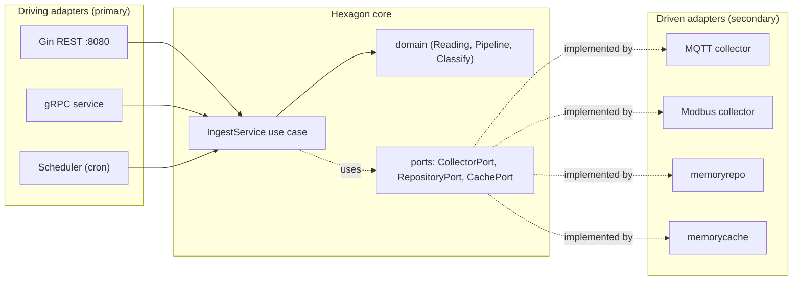

# 工业网关数据采集服务 (Industrial Gateway Data Collection Service)

> Student: `student-go` — Language: Go 1.21 + Gin framework
> Architecture: Hexagonal Architecture (Ports & Adapters)

An industrial data-collection gateway that ingests device telemetry from MQTT
brokers and Modbus TCP PLCs, normalises it through a transformation pipeline,
persists it, classifies it against threshold policies, and exposes it via a
Gin REST API, a gRPC service, and Prometheus metrics. Built following
hexagonal architecture so every external system (broker, PLC, HTTP, gRPC,
database, cache) is an *adapter* behind a *port*, making the core domain logic
pure and trivially testable.

---

## Table of Contents

- [Features](#features)
- [Architecture](#architecture)
- [Tech Stack](#tech-stack)
- [Project Structure](#project-structure)
- [Modules](#modules)
- [Installation & Setup](#installation--setup)
- [Usage Examples](#usage-examples)
- [API Reference](#api-reference)
- [Testing](#testing)
- [License](#license)

---

## Features

- **Hexagonal architecture**: pure domain model + port interfaces; every
  external system is a swappable adapter.
- **Multi-protocol ingestion**: pluggable collectors for MQTT brokers and
  Modbus TCP PLCs behind a shared `CollectorPort`.
- **Transformation pipeline**: unit normalisation (e.g. Fahrenheit → Celsius)
  and metric scaling (`rpm` factor) before persistence.
- **Threshold classification** of readings into device health status.
- **Multiple driving adapters**: Gin REST API, a gRPC service skeleton, and a
  periodic scheduler that polls all collectors on an interval.
- **Driven adapters**: in-memory repository + cache (Redis/external swappable
  via the `RepositoryPort` / `CachePort` interfaces).
- **Observability**: Prometheus metrics endpoint + Gin recovery middleware.
- **Graceful shutdown** on SIGINT/SIGTERM with scheduler cancellation.
- **Table-driven tests** across every package (12 `_test.go` files).

## Architecture



Textual overview:

```
       driving adapters                 |  domain  |           driven adapters
   ┌──────────────────┐                |          |        ┌──────────────────┐
   │  Gin REST API    │ ─► usecase ─► |  domain  | ─►     │ MQTT collector   │
   │  gRPC service    │   (IngestSvc) |  Reading |        │ Modbus collector  │
   │  scheduler (cron)│                |  Pipeline|        │ Repository (mem) │
   └──────────────────┘                |  Classify│        │ Cache (mem)      │
                                       └──────────┘        └──────────────────┘
   Ports: CollectorPort, RepositoryPort, CachePort  — interfaces in domain/.
```

## Tech Stack

| Concern        | Technology                                            |
|----------------|-------------------------------------------------------|
| Language       | Go 1.21                                               |
| Web framework  | Gin (github.com/gin-gonic/gin v1.10)                  |
| Metrics        | Prometheus client_golang v1.19 (`/metrics`)           |
| Architecture   | Hexagonal (Ports & Adapters)                          |
| Testing        | Go standard `testing` (table-driven)                  |
| Runtime        | In-memory repository & cache (externally swappable)   |

## Project Structure

```
industrial-gateway/
├── go.mod                     # module industrial-gateway, go 1.21
├── go.sum                     # dependency checksums (committed)
├── .gitignore
├── README.md
├── docs/
│   └── SDD.md                # Software Design Document (Hexagonal/TOGAF)
├── cmd/
│   └── gateway/
│       └── main.go           # wires the hexagon, starts REST + metrics + scheduler
├── internal/
│   ├── domain/               # pure model + ports (depends on nothing)
│   │   ├── reading.go        # Reading, DeviceStatus + CollectorPort/RepositoryPort/CachePort
│   │   ├── transform.go      # Transformer + Pipeline (unit normalisation)
│   │   └── classify.go       # threshold classification policy
│   ├── usecase/              # application logic (ports only)
│   │   └── ingest.go         # IngestService: collect→transform→persist→cache
│   ├── infra/                # driven adapters
│   │   ├── mqtt/             # MQTT collector
│   │   ├── modbus/           # Modbus TCP collector
│   │   ├── memoryrepo/       # in-memory RepositoryPort impl
│   │   └── memorycache/      # in-memory CachePort impl
│   └── adapter/              # driving adapters
│       ├── http/             # Gin REST adapter
│       ├── grpc/             # gRPC service adapter
│       └── metrics/          # Prometheus counters
```

## Modules

- `internal/domain/` — pure model (`Reading`, `DeviceStatus`), the
  `Transformer`/`Pipeline`, `Classify` policy, and the port interfaces.
- `internal/usecase/` — `IngestService` orchestrating collectors→pipeline→repo→cache.
- `internal/infra/memoryrepo`, `memorycache` — in-memory driven adapters.
- `internal/infra/mqtt`, `modbus` — field-device collectors (client abstracted).
- `internal/adapter/http` — Gin REST primary adapter.
- `internal/adapter/grpc` — gRPC service primary adapter.
- `internal/adapter/metrics` — Prometheus counters.
- `cmd/gateway/main.go` — wires the hexagon, starts REST + metrics + scheduler.

## Installation & Setup

```bash
go mod download      # fetch dependencies (sums verified from go.sum)
go build ./...       # compile all packages
go run ./cmd/gateway # REST :8080, Prometheus metrics :9090
```

## Usage Examples

```bash
# Ingest a reading (via the REST adapter)
curl -X POST localhost:8080/api/v1/ingest \
  -H 'Content-Type: application/json' \
  -d '{"device_id":"pump-1","metric":"temperature","value":96,"unit":"C","source":"rest"}'
# => {"device_id":"pump-1","status":"CRITICAL","saved":true,...}

# Health & device endpoints
curl localhost:8080/api/v1/health
curl localhost:8080/api/v1/readings/pump-1
curl localhost:8080/api/v1/status/pump-1

# Prometheus metrics
curl localhost:9090/metrics
```

The scheduler polls every registered collector every 5s; with the default
config no collectors are registered, so it logs "ingested 0 readings" until
MQTT/Modbus collectors are injected in `main.go`.

## API Reference

Routes are registered in `internal/adapter/http/router.go` under the
`/api/v1` group.

| Method | Path | Body / Params | Description |
|--------|------|---------------|-------------|
| GET | `/api/v1/health` | — | Service health (repo + cache state) |
| POST | `/api/v1/ingest` | `{device_id,metric,value,unit,source}` JSON | Ingest a reading (validate → transform → persist → cache) |
| GET | `/api/v1/readings/:device` | path param | Latest persisted reading(s) for a device |
| GET | `/api/v1/status/:device` | path param | Computed device health status |

| Endpoint | Port | Adapter |
|----------|------|---------|
| REST API | 8080 | `internal/adapter/http` (Gin) |
| Prometheus metrics | 9090 | `internal/adapter/metrics` |

## Testing

```bash
go mod tidy
go test -cover ./...      # table-driven tests across every package
go test -v ./internal/domain/...   # single package
go test -race ./...                 # with the race detector
```

Tests are table-driven and cover every layer: domain validation,
transformation pipeline, classification, the use case orchestration, each
adapter (HTTP, gRPC, metrics), and every driven adapter (memoryrepo,
memorycache, mqtt, modbus). Because the domain depends only on the standard
library, its tests run with no mocks of external systems.

See `docs/SDD.md` for the full Software Design Document.

## License

Released for educational use as part of the Industrial IoT student programme.
No specific open-source license is declared; treat the source as proprietary
to the programme unless otherwise instructed.
