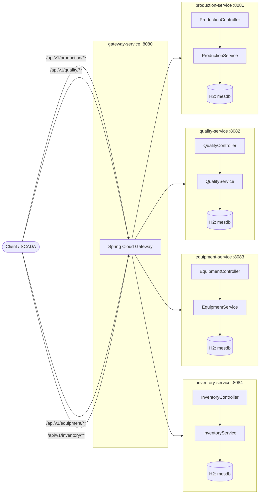

# 智能工厂 MES 系统 (Smart Factory Manufacturing Execution System)

> Student: `student-java` — Language: Java 17 + Spring Boot 3.2.5 + Maven
> Architecture: Microservices (TOGAF Application Architecture)

A complete Manufacturing Execution System (MES) for an industrial smart factory,
implemented as five independently deployable Spring Boot microservices behind an
API gateway. Each service follows the layered Controller / Service / Repository /
Entity pattern and ships with comprehensive JUnit 5 unit tests (mocked repositories)
plus Spring Boot integration tests backed by an in-memory H2 database.

The system digitises the four core loops of a modern factory — production
scheduling, quality control, equipment monitoring and inventory management — and
exposes cross-cutting shop-floor KPIs (yield rate, first-pass yield, defect rate,
OEE, inventory value) computed from the operational data.

---

## Table of Contents

- [Features](#features)
- [Architecture](#architecture)
- [Tech Stack](#tech-stack)
- [Project Structure](#project-structure)
- [Modules](#modules)
- [Installation & Setup](#installation--setup)
- [Usage Examples](#usage-examples)
- [API Reference](#api-reference)
- [Testing](#testing)
- [Metrics & KPIs](#metrics--kpis)
- [License](#license)

---

## Features

- **Five microservices**, each independently buildable, deployable and scalable.
- **Production lifecycle**: create → start → report progress → complete/cancel,
  with live yield-rate computation.
- **Quality control**: inspection records with first-pass yield (FPY) and defect rate.
- **Equipment monitoring**: registry, telemetry ingestion, predictive fault
  detection, and Overall Equipment Effectiveness (OEE).
- **Inventory management**: material master data, stock movements
  (IN/OUT/ADJUST), reorder/safety-stock thresholds, total inventory value.
- **Edge gateway**: Spring Cloud Gateway routes `/api/v1/{production,quality,
  equipment,inventory}/**` to the right service, plus health/info endpoints.
- **Layered architecture** per service: Controller → Service → Repository → Entity.
- **TDD**: pure unit tests (Mockito-mocked repositories) + HTTP/JPA integration
  tests (MockMvc + H2) for every module.
- **Zero external dependencies at runtime**: H2 in-memory DB and embedded
  Tomcat keep the services self-contained.
- **TOGAF Application Architecture** viewpoint documented in `docs/SDD.md`.

## Architecture



Textual overview:

```
                ┌──────────────────────────────────────────────────┐
   HTTP/REST ─► │ gateway-service :8080  (Spring Cloud Gateway)    │
                └───┬─────────┬───────────┬────────────┬──────────┘
                    │         │           │            │
            :8081   ▼    :8082▼      :8083▼       :8084▼
        production    quality     equipment     inventory
        (orders)      (inspections) (telemetry)  (materials)
            │              │            │             │
        JPA/H2 ────────────────────────────────────────►  in-memory mesdb
```

Each business service is a vertically sliced, layered module:

```
controller (REST) ─► service (domain logic + KPIs) ─► repository (Spring Data JPA)
                                                       │
                                                     entity (JPA)
```

## Tech Stack

| Concern        | Technology                                            |
|----------------|-------------------------------------------------------|
| Language       | Java 17 (LTS)                                         |
| Framework      | Spring Boot 3.2.5, Spring Web, Spring Data JPA        |
| Edge gateway   | Spring Cloud Gateway (reactive)                       |
| Database       | H2 in-memory (swappable to MySQL/PostgreSQL via JDBC) |
| Build          | Maven multi-module (`packaging: pom`)                 |
| Validation     | Jakarta Bean Validation (`@Valid`)                    |
| Testing        | JUnit 5, Mockito, Spring Boot Test, MockMvc, H2       |
| Metrics        | Spring Actuator (`/actuator/health`, `info`, `metrics`) |
| Dependency mirror | Aliyun Maven (`https://maven.aliyun.com/repository/public`) |

## Project Structure

```
mes-system/
├── pom.xml                       # parent POM, module aggregation, dep management
├── .gitignore
├── README.md
├── docs/
│   ├── SDD.md                    # full Software Design Document (TOGAF)
│   └── diagrams/
│       ├── architecture.puml
│       └── production-sequence.puml
├── gateway-service/             # :8080 — Spring Cloud Gateway edge router
│   ├── pom.xml
│   └── src/{main,test}/.../gateway/GatewayApplication.java
├── production-service/          # :8081 — production order lifecycle + yield rate
│   ├── pom.xml
│   └── src/{main,test}/.../production/{controller,service,repository,entity,dto,config}
├── quality-service/             # :8082 — inspections, FPY, defect rate
│   ├── pom.xml
│   └── src/{main,test}/.../quality/{controller,service,repository,entity,dto}
├── equipment-service/           # :8083 — equipment registry, telemetry, OEE
│   ├── pom.xml
│   └── src/{main,test}/.../equipment/{controller,service,repository,entity,dto}
└── inventory-service/           # :8084 — materials, stock movements, inventory value
    ├── pom.xml
    └── src/{main,test}/.../inventory/{controller,service,repository,entity,dto}
```

## Modules

| Service | Port | Package | Responsibility |
|---------|------|---------|----------------|
| `gateway-service` | 8080 | `com.mes.gateway` | Spring Cloud Gateway edge router; routes `/api/v1/{production,quality,equipment,inventory}/**` |
| `production-service` | 8081 | `com.mes.production` | Production order lifecycle: create → start → progress → complete/cancel; yield-rate metrics |
| `quality-service` | 8082 | `com.mes.quality` | Inspection records, first-pass-yield (FPY), defect rate |
| `equipment-service` | 8083 | `com.mes.equipment` | Equipment registry, telemetry ingestion, predictive fault detection, OEE |
| `inventory-service` | 8084 | `com.mes.inventory` | Material master data, stock movements (IN/OUT/ADJUST), reorder/safety stock, inventory value |

## Installation & Setup

### Prerequisites

- **JDK 17** (LTS) — `java -version`
- **Maven 3.8+** — `mvn -version`

### Build all modules

```bash
# from project root (mes-system/)
mvn clean test            # compile + run all unit & integration tests
mvn -pl production-service test           # run tests for a single module
mvn -pl equipment-service -am package     # build one service jar with its deps
mvn -pl production-service spring-boot:run # run a single service
```

Dependencies resolve from the Aliyun Maven mirror
(`https://maven.aliyun.com/repository/public`). Tests use an in-memory H2
database, so **no external database is required**.

## Usage Examples

### Start the services

```bash
# Terminal 1 — business services (any subset)
cd production-service && mvn spring-boot:run   # http://localhost:8081
cd quality-service    && mvn spring-boot:run   # http://localhost:8082
cd equipment-service  && mvn spring-boot:run   # http://localhost:8083
cd inventory-service  && mvn spring-boot:run   # http://localhost:8084

# Terminal 2 — edge gateway (optional; routes to the services above)
cd gateway-service && mvn spring-boot:run      # http://localhost:8080
```

### Production workflow

```bash
# Create a production order
curl -X POST localhost:8081/api/v1/production/orders \
  -H 'Content-Type: application/json' \
  -d '{"productCode":"P-A100","quantity":100,"priority":"HIGH"}'
# Start production
curl -X POST localhost:8081/api/v1/production/orders/<id>/start
# Report progress (60 good units, 2 defects)
curl -X POST "localhost:8081/api/v1/production/orders/<id>/progress?completed=60&defects=2"
# Yield-rate metric
curl localhost:8081/api/v1/production/orders/metrics/yield-rate
```

### Through the gateway

```bash
# Same calls, but routed by gateway-service on :8080
curl localhost:8080/api/v1/production/orders/metrics/yield-rate
curl localhost:8080/actuator/health
```

## API Reference

Base URL per service (or via `gateway-service:8080`):

### production-service (`/api/v1/production/orders`)
| Method | Path | Body / Params | Description |
|--------|------|---------------|-------------|
| POST | `/orders` | `{productCode,quantity,priority}` | Create a production order |
| GET | `/orders/{id}` | — | Get one order |
| GET | `/orders?status=` | `status` query | List (optionally by status) |
| POST | `/orders/{id}/start` | — | Start production |
| POST | `/orders/{id}/progress?completed=&defects=` | — | Report progress |
| POST | `/orders/{id}/cancel` | — | Cancel order |
| GET | `/orders/metrics/yield-rate` | — | Yield-rate KPI |

### quality-service (`/api/v1/quality/inspections`)
| Method | Path | Description |
|--------|------|-------------|
| POST | `/inspections` | Create an inspection record |
| GET | `/inspections/{id}` | Get one inspection |
| GET | `/inspections` | List inspections |
| GET | `/inspections/metrics/fpy` | First-pass-yield KPI |
| GET | `/inspections/metrics/defect-rate` | Defect-rate KPI |

### equipment-service (`/api/v1/equipment`)
| Method | Path | Description |
|--------|------|-------------|
| POST | `/equipment` | Register equipment |
| GET | `/equipment/{id}` | Get one equipment |
| GET | `/equipment` | List (optionally by status) |
| PUT | `/equipment/{id}/status` | Update status (RUNNING/FAULT/IDLE) |
| POST | `/equipment/{id}/telemetry` | Ingest telemetry (predictive fault check) |
| GET | `/equipment/metrics/oee` | Overall Equipment Effectiveness |

### inventory-service (`/api/v1/inventory`)
| Method | Path | Description |
|--------|------|-------------|
| POST | `/materials` | Create a material master |
| GET | `/materials` | List materials |
| GET | `/materials/{sku}` | Get one material |
| GET | `/materials/low-stock` | Below reorder point |
| GET | `/materials/critical` | Below safety stock |
| POST | `/movements` | Stock movement (IN/OUT/ADJUST) |
| GET | `/metrics/value` | Total inventory value |

## Testing

```bash
mvn test                          # all modules
mvn test -pl production-service   # single module
```

Tests were written alongside/preceding the implementation (TDD):
- **Unit tests** (`*Test.java`) mock the JPA repositories with `@Mock` +
  Mockito to verify service/domain logic in isolation.
- **Integration tests** (`*IT.java`) verify the full HTTP + JPA stack with
  `MockMvc` against an in-memory H2 database.
- Run coverage with `mvn test jacoco:report` (add the jacoco plugin if desired).

## Metrics & KPIs

| KPI | Service | Formula |
|-----|---------|---------|
| Yield rate | production | good units / total completed × 100 |
| First-pass yield (FPY) | quality | passed / (passed + failed) × 100 |
| Defect rate | quality | defects / total inspections × 100 |
| OEE | equipment | availability (= (total−faulted)/total) × 100 |
| Inventory value | inventory | Σ(quantity × unit price) |

## License

Released for educational use as part of the Industrial IoT student programme.
No specific open-source license is declared; treat the source as proprietary
to the programme unless otherwise instructed.
