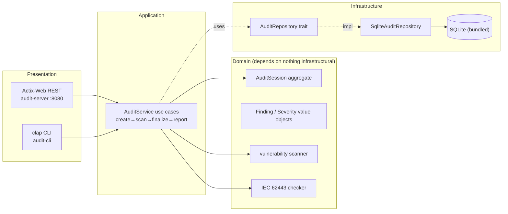

# 工业安全审计系统 (Industrial Security Audit System)

> Student: `student-rust` — Language: Rust 1.98 + Actix-Web
> Architecture: Domain-Driven Design (DDD)

A security audit platform for industrial control systems (ICS) that runs
vulnerability scans against a signature database, evaluates IEC 62443
compliance, persists audit sessions and findings to SQLite, and exposes the
whole lifecycle through an Actix-Web REST API and a `clap` CLI.

---

## Table of Contents

- [Features](#features)
- [Architecture](#architecture)
- [Tech Stack](#tech-stack)
- [Project Structure](#project-structure)
- [Modules](#modules)
- [Installation & Setup](#installation--setup)
- [Usage Examples](#usage-examples)
- [REST API Reference](#rest-api-reference)
- [CLI Reference](#cli-reference)
- [Testing](#testing)
- [Environment Variables](#environment-variables)
- [License](#license)

---

## Features

- **Full audit lifecycle**: create session → run vulnerability scan → finalize
  → generate IEC 62443 compliance report, all persisted to SQLite.
- **Vulnerability signature database** of common ICS weaknesses (e.g. default
  HMI credentials, unencrypted Modbus traffic, outdated PLC firmware) with
  CVSS scores and remediation guidance.
- **Severity classification** derived from CVSS scores (Info/Low/Medium/High/
  Critical) using standard breakpoints (≥9 Critical, ≥7 High, ≥4 Medium).
- **IEC 62443 compliance checker** with a requirements catalog across Security
  Levels 1–4 (human-user ID, authorization, communication integrity, network
  segmentation, resource availability, …) and a per-requirement PASS/FAIL/N-A
  report with a compliance score.
- **DDD layering**: a pure domain (aggregate root + value objects + domain
  services) that depends on nothing infrastructural; infrastructure implements
  the repository trait.
- **Two presentation adapters**: an Actix-Web REST API (`audit-server`) and a
  `clap` CLI (`audit-cli`) for one-shot audits.
- **Self-contained builds**: the bundled `rusqlite` feature compiles SQLite from
  source, so no system SQLite library is required.
- **Comprehensive integration tests** against an in-memory SQLite repository.

## Architecture



Textual overview:

```
   Presentation         Application            Domain              Infrastructure
   ┌────────────┐      ┌──────────────┐      ┌──────────────┐      ┌──────────────────┐
   │ actix HTTP │ ──► │ AuditService │ ──► │ AuditSession │ ──► │ SqliteAuditRepo  │
   │ clap CLI    │      │ (use cases)  │      │ Finding       │      │ rusqlite         │
   └────────────┘      └──────────────┘      │ Vuln scanner  │      └──────────────────┘
                                               │ IEC62443 check  │
                                               └──────────────┘
   Domain depends on nothing infrastructural; infra implements the repository trait.
```

## Tech Stack

| Concern        | Technology                                            |
|----------------|-------------------------------------------------------|
| Language       | Rust (edition 2021)                                   |
| Web framework  | Actix-Web 4                                           |
| Database       | SQLite via `rusqlite` 0.31 (bundled, compiled from source) |
| CLI            | `clap` 4 (derive)                                    |
| Serialization  | `serde` + `serde_json`                                |
| IDs            | `uuid` v1 (v4)                                        |
| Time           | `chrono` 0.4                                          |
| Logging        | `log` + `env_logger`                                 |
| Errors         | `thiserror` (domain errors)                          |
| Crates mirror  | USTC (`sparse+https://mirrors.ustc.edu.cn/crates.io-index/`, see `.cargo/config.toml`) |

## Project Structure

```
security-audit/
├── Cargo.toml             # package + lib + 2 bins, dependencies
├── Cargo.lock             # dependency lock (committed — this is a binary crate)
├── .cargo/config.toml     # crates.io mirror (USTC)
├── .gitignore
├── README.md
├── docs/
│   └── SDD.md            # Software Design Document (DDD)
├── src/
│   ├── lib.rs            # crate root (re-exports domain/application/infra)
│   ├── domain/           # pure domain (depends on nothing infrastructural)
│   │   ├── audit.rs      # AuditSession aggregate, Finding, Severity, AuditStatus
│   │   ├── vulnerability.rs # VulnerabilityRule + signature_db() + scan()
│   │   ├── compliance.rs # IEC 62443 requirements catalog + evaluate() + score
│   │   ├── error.rs      # DomainError
│   │   └── mod.rs
│   ├── application/       # use cases
│   │   ├── audit_service.rs # AuditService: create/run_scan/finalize/compliance_report
│   │   └── mod.rs
│   ├── infrastructure/    # adapters
│   │   ├── repository.rs  # AuditRepository trait + SqliteAuditRepository
│   │   ├── http.rs        # Actix-Web routes + run_server()
│   │   └── mod.rs
│   └── bin/
│       ├── cli.rs         # audit-cli (clap)
│       └── server.rs      # audit-server (Actix-Web)
└── tests/                 # integration tests
    ├── application_test.rs
    ├── compliance_test.rs
    ├── domain_audit_test.rs
    ├── repository_test.rs
    └── vulnerability_test.rs
```

## Modules

- `src/domain/` — `AuditSession` aggregate, `Finding`/`Severity` value objects,
  vulnerability signature scanner, IEC 62443 compliance checker, domain errors.
- `src/application/` — `AuditService` use cases (create → scan → finalize → report).
- `src/infrastructure/repository.rs` — `AuditRepository` trait + SQLite impl.
- `src/infrastructure/http.rs` — Actix-Web REST adapter + error mapping.
- `src/bin/cli.rs` — `audit-cli` (clap) for one-shot audits.
- `src/bin/server.rs` — `audit-server` REST API on :8080.

## Installation & Setup

```bash
cargo build        # build lib + 2 binaries (audit-cli, audit-server)
cargo test         # run the full test suite
cargo build --release   # optimized binaries in target/release/
```

The bundled `rusqlite` feature compiles SQLite from source, so **no system
SQLite library is needed**. Crates fetch from the USTC mirror (see
`.cargo/config.toml`).

## Usage Examples

### CLI (one-shot audits)

```bash
# Create an audit session targeting plc-1, audited by alice
cargo run --bin audit-cli -- create -t plc-1 -a alice
# Run a vulnerability scan using a comma-separated list of fingerprints
cargo run --bin audit-cli -- scan -i <id> -f hmi-default-creds,modbus-plaintext
# Finalize the audit
cargo run --bin audit-cli -- finalize -i <id>
# Generate an IEC 62443 compliance report for Security Level 2
cargo run --bin audit-cli -- compliance -i <id> -l 2
# List all audit sessions
cargo run --bin audit-cli -- list
```

### REST API server

```bash
cargo run --bin audit-server    # REST API on http://0.0.0.0:8080
```

## REST API Reference

Base URL: `http://localhost:8080`. Routes defined in `src/infrastructure/http.rs`.

| Method | Path | Request body | Description |
|--------|------|---------------|-------------|
| POST | `/api/v1/audits` | `{target, auditor}` | Create + start an audit session |
| GET | `/api/v1/audits` | — | List all audit sessions |
| POST | `/api/v1/audits/{id}/scan` | `{fingerprints:[]}` | Run vulnerability scan, attach findings |
| POST | `/api/v1/audits/{id}/finalize` | — | Complete the audit session |
| POST | `/api/v1/audits/{id}/compliance` | `{security_level}` | IEC 62443 compliance report (SL) |
| GET | `/api/v1/health` | — | `{status}` |

```bash
# End-to-end example via curl
id=$(curl -s -X POST localhost:8080/api/v1/audits -H 'Content-Type: application/json' \
     -d '{"target":"plc-1","auditor":"alice"}' | jq -r .id)
curl -X POST localhost:8080/api/v1/audits/$id/scan \
  -H 'Content-Type: application/json' -d '{"fingerprints":["hmi-default-creds"]}'
curl -X POST localhost:8080/api/v1/audits/$id/finalize
curl -X POST localhost:8080/api/v1/audits/$id/compliance \
  -H 'Content-Type: application/json' -d '{"security_level":2}'
```

## CLI Reference

`audit-cli` subcommands (defined in `src/bin/cli.rs` via clap derive):

| Subcommand | Flags | Description |
|------------|-------|-------------|
| `create`   | `-t/--target`, `-a/--auditor` | Create a new audit session |
| `scan`     | `-i/--id`, `-f/--fingerprints` | Run a vulnerability scan (comma-separated fingerprints) |
| `finalize` | `-i/--id` | Finalize an audit session |
| `compliance` | `-i/--id`, `-l/--level` | IEC 62443 compliance report (Security Level 1–4) |
| `list`     | — | List all audit sessions |

## Testing

```bash
cargo test                 # all unit + integration tests
cargo test -- --nocapture  # show println! output
cargo test --test application_test  # a single integration test file
```

Integration tests (in `tests/`) exercise the public API against an in-memory
SQLite repository: `domain_audit_test`, `vulnerability_test`,
`compliance_test`, `application_test`, `repository_test`.

## Environment Variables

- `AUDIT_DB` (default `audit.db`) — SQLite database file path used by both
  `audit-cli` and `audit-server`. Tests use `SqliteAuditRepository::in_memory()`.
- `RUST_LOG` (default `info`) — log filter for `audit-server`
  (`env_logger::Env::default().default_filter_or("info")`).

See `docs/SDD.md` for the full Software Design Document.

## License

Released for educational use as part of the Industrial IoT student programme.
No specific open-source license is declared; treat the source as proprietary
to the programme unless otherwise instructed.
